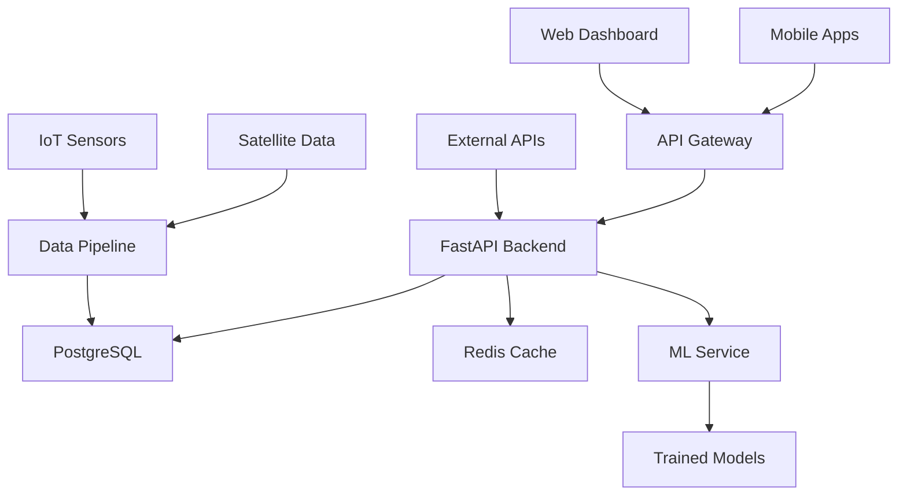

# 🌍 CarbonSense - Project Structure

This document outlines the complete project architecture for CarbonSense, a comprehensive climate action tracking platform.

## 📁 Repository Structure

```
carbonsense/
├── 📱 mobile/                          # React Native mobile application
│   ├── src/
│   │   ├── components/                 # Reusable UI components
│   │   ├── screens/                    # Main app screens
│   │   ├── navigation/                 # Navigation configuration
│   │   ├── services/                   # API and external services
│   │   ├── store/                      # Redux state management
│   │   ├── utils/                      # Helper functions
│   │   └── types/                      # TypeScript type definitions
│   ├── assets/                         # Images, fonts, icons
│   ├── ios/                           # iOS-specific code
│   ├── android/                       # Android-specific code
│   └── package.json
│
├── 🖥️ web/                            # Next.js corporate dashboard
│   ├── src/
│   │   ├── components/                 # Reusable React components
│   │   ├── pages/                      # Next.js pages
│   │   ├── hooks/                      # Custom React hooks
│   │   ├── lib/                        # Utility libraries
│   │   ├── styles/                     # Tailwind CSS styles
│   │   └── types/                      # TypeScript definitions
│   ├── public/                         # Static assets
│   └── package.json
│
├── 🔧 backend/                         # FastAPI Python backend
│   ├── app/
│   │   ├── api/                        # API route handlers
│   │   │   ├── v1/                     # API version 1
│   │   │   │   ├── auth/               # Authentication endpoints
│   │   │   │   ├── users/              # User management
│   │   │   │   ├── carbon/             # Carbon tracking
│   │   │   │   ├── challenges/         # Community challenges
│   │   │   │   ├── corporate/          # Enterprise features
│   │   │   │   └── analytics/          # Data analytics
│   │   │   └── dependencies.py         # Common dependencies
│   │   ├── core/                       # Core application logic
│   │   │   ├── config.py               # Configuration settings
│   │   │   ├── security.py             # Security utilities
│   │   │   └── database.py             # Database connection
│   │   ├── models/                     # SQLAlchemy models
│   │   ├── schemas/                    # Pydantic schemas
│   │   ├── services/                   # Business logic
│   │   └── utils/                      # Helper functions
│   ├── tests/                          # Unit and integration tests
│   ├── migrations/                     # Database migrations
│   └── requirements.txt
│
├── 🤖 ml/                             # Machine Learning pipeline
│   ├── notebooks/                      # Jupyter research notebooks
│   ├── models/                         # Trained ML models
│   ├── training/                       # Training scripts
│   ├── inference/                      # Prediction services
│   └── data/                          # Training datasets
│
├── 🗄️ data/                           # Data processing and ETL
│   ├── scrapers/                       # Data collection scripts
│   ├── processors/                     # Data transformation
│   ├── pipelines/                      # Airflow DAGs
│   └── seeds/                         # Demo and test data
│
├── 🐳 deployment/                      # Infrastructure and deployment
│   ├── docker/                         # Docker configurations
│   ├── kubernetes/                     # K8s manifests
│   ├── terraform/                      # Infrastructure as code
│   └── scripts/                       # Deployment scripts
│
├── 📚 docs/                           # Documentation
│   ├── api/                           # API documentation
│   ├── guides/                        # User and developer guides
│   ├── images/                        # Screenshots and diagrams
│   └── design/                        # UI/UX design files
│
├── 🧪 tests/                          # End-to-end tests
│   ├── e2e/                           # End-to-end test suites
│   ├── integration/                    # Integration tests
│   └── performance/                   # Load and performance tests
│
├── 📄 .github/                        # GitHub workflows and templates
│   ├── workflows/                      # CI/CD pipelines
│   ├── ISSUE_TEMPLATE/                # Issue templates
│   └── PULL_REQUEST_TEMPLATE.md       # PR template
│
├── 📋 configs/                        # Configuration files
│   ├── .env.example                   # Environment variables template
│   ├── .gitignore                     # Git ignore rules
│   ├── .prettierrc                    # Code formatting
│   ├── .eslintrc.js                   # Linting rules
│   └── tsconfig.json                  # TypeScript configuration
│
├── 📊 analytics/                      # Business intelligence
│   ├── dashboards/                    # BI dashboard configs
│   ├── reports/                       # Automated reports
│   └── metrics/                       # KPI tracking
│
└── 📖 README.md                       # Main project documentation
```

## 🏗️ Component Architecture

### Mobile App (React Native)
- **Screen Structure**: Tab-based navigation with stack navigators
- **State Management**: Redux Toolkit with RTK Query for API calls
- **UI Components**: Custom design system with accessibility support
- **Platform Features**: Camera, GPS, push notifications, biometric auth

### Web Dashboard (Next.js)
- **Authentication**: NextAuth.js with corporate SSO support
- **Data Visualization**: Chart.js and D3.js for interactive charts
- **Real-time Updates**: WebSocket connections for live data
- **Responsive Design**: Mobile-first responsive layout

### Backend API (FastAPI)
- **Authentication**: JWT tokens with refresh token rotation
- **Database**: PostgreSQL with PostGIS for geospatial data
- **Caching**: Redis for session storage and API response caching
- **Background Tasks**: Celery for async processing
- **Documentation**: Auto-generated OpenAPI/Swagger docs

### ML Pipeline
- **Feature Engineering**: Automated feature extraction from user behavior
- **Model Training**: Scikit-learn and TensorFlow for prediction models
- **Model Serving**: FastAPI endpoints for real-time inference
- **Monitoring**: MLflow for model versioning and performance tracking

## 🚀 Deployment Strategy

### Development Environment
- **Local Development**: Docker Compose for full stack setup
- **Hot Reloading**: All services support live code reloading
- **Database**: Local PostgreSQL with sample data
- **External APIs**: Mock services for development

### Staging Environment
- **Cloud Platform**: AWS/GCP with Kubernetes orchestration
- **Database**: Managed PostgreSQL with read replicas
- **CDN**: CloudFront/CloudFlare for static asset delivery
- **Monitoring**: DataDog/New Relic for application monitoring

### Production Environment
- **High Availability**: Multi-region deployment with load balancing
- **Auto Scaling**: Kubernetes HPA for dynamic scaling
- **Database**: Sharded PostgreSQL with automated backups
- **Security**: WAF, SSL/TLS, OAuth 2.0, rate limiting

## 📊 Data Flow Architecture



## 🔒 Security Architecture

### Authentication & Authorization
- **Multi-Factor Authentication**: TOTP and SMS verification
- **Role-Based Access Control**: Granular permissions for different user types
- **API Security**: Rate limiting, input validation, SQL injection prevention
- **Data Privacy**: GDPR/CCPA compliance with data anonymization

### Data Protection
- **Encryption**: AES-256 for data at rest, TLS 1.3 for data in transit
- **Audit Logging**: Comprehensive activity tracking
- **Backup Strategy**: Automated backups with point-in-time recovery
- **Disaster Recovery**: Multi-region backup and failover procedures

This architecture ensures scalability, maintainability, and security while delivering a seamless user experience across all platforms.